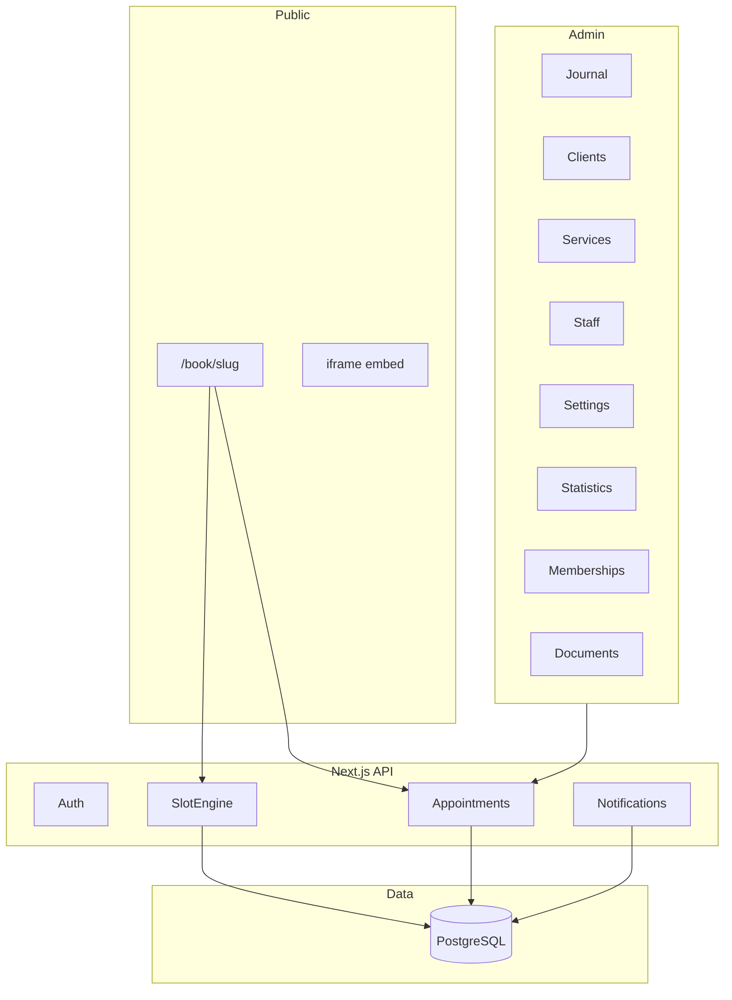

# booking-crm — спецификация для реализации

Версия документа: 1.0  
Путь проекта: `~/Projects/booking-crm`  
Язык UI: русский (по умолчанию)

---

## Содержание

1. [Введение](#1-введение)
2. [Bootstrap и стек](#2-bootstrap-и-стек)
3. [Архитектура](#3-архитектура)
4. [Роли и навигация](#4-роли-и-навигация)
5. [Модель данных (Prisma)](#5-модель-данных-prisma)
6. [Движок слотов](#6-движок-слотов)
7. [Модули — функциональные требования](#7-модули--функциональные-требования)
8. [API — сводка](#8-api--сводка)
9. [Плейсхолдеры](#9-плейсхолдеры)
10. [Критерии приёмки MVP](#10-критерии-приёмки-mvp)
11. [Вне scope MVP](#11-вне-scope-mvp)
12. [Дорожная карта](#12-дорожная-карта)
13. [Структура репозитория](#13-структура-репозитория)

---

## 1. Введение

### 1.1 Назначение

**booking-crm** — SaaS для онлайн-записи клиентов и управления бизнесом (салоны, клиники, вейк-парки, почасовая аренда). Функциональная идея аналогична [Rubitime](https://rubitime.ru).

**Юридически:** не копировать название Rubitime, тексты лендинга, визуальный дизайн и фирменный стиль 1:1. Свой бренд, свои формулировки, своя цветовая схема.

### 1.2 Целевые ниши

| Ниша | Особенности |
|------|-------------|
| Салон красоты | `staff.type = person`, услуга привязана к мастеру |
| Вейк-парк / аренда | `staff.type = equipment`, один ресурс = несколько записей «ресурс × смена», услуги с окнами времени и разной ценой |

### 1.3 Документы для агента

- **SPEC.md** (этот файл) — продукт и техника
- **[AGENT.md](./AGENT.md)** — порядок спринтов и правила работы

---

## 2. Bootstrap и стек

| Компонент | Выбор |
|-----------|--------|
| Framework | Next.js 15, App Router |
| Language | TypeScript |
| ORM | Prisma |
| DB | PostgreSQL |
| UI | shadcn/ui + Tailwind CSS |
| Email (v1.1) | Resend |
| Auth | NextAuth.js v5 (Credentials + session) **или** Clerk |
| Deploy (ориентир) | Vercel + Neon / Supabase Postgres |

### 2.1 Переменные окружения (минимум)

```env
DATABASE_URL=
NEXTAUTH_SECRET=
NEXTAUTH_URL=
RESEND_API_KEY=          # v1.1
```

### 2.2 Мультитенантность

Все бизнес-сущности содержат `organizationId`. API и страницы admin фильтруют по org текущего пользователя. Публичный виджет — по `organization.slug`.

---

## 3. Архитектура



### 3.1 Лимиты тарифа (v1.1)

В UI отображать счётчики как у референса: `Филиалы 3/10`, `Сотрудники 25/50`, `Услуги 22/100`.

Таблица `SubscriptionPlan`: `maxBranches`, `maxStaff`, `maxServices`. MVP: один план «Free» с высокими лимитами или без проверки.

---

## 4. Роли и навигация

### 4.1 Роли

| Роль | Доступ |
|------|--------|
| `owner` | Всё + биллинг (заглушка) |
| `admin` | Все разделы org |
| `staff` | Только свой календарь и свои записи |

### 4.2 Боковое меню админки

| Раздел | Route (пример) | Фаза |
|--------|----------------|------|
| Журнал записей | `/admin/journal` | MVP |
| Статистика | `/admin/statistics` | v1.1 |
| Клиенты | `/admin/clients` | MVP |
| Абонементы | `/admin/memberships` | v1.2 |
| Промокоды | `/admin/promo-codes` | v1.2 |
| Расчёт зарплат | `/admin/payroll` | v2 |
| Документы | `/admin/documents` | v1.3 |
| Мессенджер | `/admin/messenger` | v2+ |
| Интеграции | `/admin/integrations` | v2+ |
| Компания | `/admin/company` | MVP |
| Филиалы | `/admin/branches` | MVP |
| Сотрудники | `/admin/staff` | MVP |
| Услуги | `/admin/services` | MVP |
| Настройки | `/admin/settings` | MVP |
| Поддержка | внешняя ссылка / форма | v2 |

Badge на «Журнал записей» и колокольчик: число неподтверждённых записей / непрочитанных уведомлений.

### 4.3 Онбординг-визард

Шаги: **Компания → Филиалы → Сотрудники → Услуги → Настройки** (прогресс-бар вверху страниц CRUD).

---

## 5. Модель данных (Prisma)

Ниже — логическая схема. Имена полей — camelCase в Prisma.

### 5.1 Organization & billing

```prisma
model Organization {
  id        String   @id @default(cuid())
  name      String
  slug      String   @unique  // для /book/[slug]
  timezone  String   @default("Europe/Moscow")
  currency  String   @default("RUB")
  createdAt DateTime @default(now())
  // relations: branches, members, settings, ...
}

model SubscriptionPlan {
  id           String @id @default(cuid())
  name         String
  maxBranches  Int
  maxStaff     Int
  maxServices  Int
}

model OrganizationMember {
  id             String   @id @default(cuid())
  organizationId String
  userId         String
  role           MemberRole // owner | admin | staff
  @@unique([organizationId, userId])
}

enum MemberRole { owner admin staff }
```

### 5.2 Branch

```prisma
model Branch {
  id             String   @id @default(cuid())
  organizationId String
  name           String
  address        String?
  phone          String?
  isActive       Boolean  @default(true)
  sortOrder      Int      @default(0)
}
```

### 5.3 Staff & schedule

```prisma
enum StaffType { person equipment room }

model Staff {
  id             String    @id @default(cuid())
  organizationId String
  branchId       String
  name           String
  type           StaffType @default(person)
  photoUrl       String?
  descriptionHtml String?
  isVisible      Boolean   @default(true)  // «Отображать» в виджете
  isActive       Boolean   @default(true)
  sortOrder      Int       @default(0)
  slotIntervalMin Int      @default(15)
  scheduleMode   String    @default("by_weekday")
  userId         String?   // login для role staff
  deletedAt      DateTime?
}

model StaffWeekdayRule {
  id         String @id @default(cuid())
  staffId    String
  weekday    Int    // 0=Вс .. 6=Сб или 1=Пн .. 7=Вс — зафиксировать в коде
  isWorking  Boolean
  timeFrom   String // "10:00"
  timeTo     String // "16:00"
  @@unique([staffId, weekday])
}

model StaffBreak {
  id       String  @id @default(cuid())
  staffId  String
  weekday  Int?    // null = все дни
  timeFrom String
  timeTo   String
}
```

**Паттерн «ресурс × смена»:** несколько записей `Staff` с именами вида `Реверс №1 (Будние 10:00-16:00)` — отдельные колонки в журнале.

### 5.4 Services

```prisma
model Service {
  id               String   @id @default(cuid())
  organizationId   String
  branchId         String
  categoryId       String?
  name             String
  description      String?
  photoUrl         String?
  durationMinutes  Int
  bufferBefore     Int      @default(0)
  bufferAfter      Int      @default(0)
  price            Decimal  @db.Decimal(10, 2)
  bookableFrom     String?  // "10:00"
  bookableTo       String?  // "16:00"
  weekdaysMask     Int?     // битовая маска
  isActive         Boolean  @default(true)
  isOnlineBookable Boolean  @default(true)
  sortOrder        Int      @default(0)
  color            String?
  deletedAt        DateTime?
}

model ServiceStaff {
  serviceId String
  staffId   String
  @@id([serviceId, staffId])
}
```

### 5.5 Clients

```prisma
enum DiscountType { fixed percent }

model Client {
  id               String        @id @default(cuid())
  organizationId   String
  firstName        String?
  lastName         String?
  middleName       String?
  phone            String        // normalized E.164
  email            String?
  avatarUrl        String?
  source           String?
  notesHtml        String?
  discountType     DiscountType?
  discountValue    Decimal?
  isBlacklisted    Boolean       @default(false)
  requiresPrepay   Boolean       @default(false)
  deletedAt        DateTime?
  createdAt        DateTime      @default(now())
  @@unique([organizationId, phone])
}
```

### 5.6 Appointments

```prisma
enum AppointmentStatus {
  booked
  confirmed
  completed
  cancelled
  no_show
}

enum AppointmentSource {
  admin
  widget
  phone
  other
}

model Appointment {
  id               String            @id @default(cuid())
  organizationId   String
  branchId         String
  clientId         String
  staffId          String
  serviceId        String
  publicNumber     Int?              // #8331015 display
  startAt          DateTime
  endAt            DateTime
  status           AppointmentStatus @default(booked)
  source           AppointmentSource @default(admin)
  price            Decimal           @db.Decimal(10, 2)
  durationMinutes  Int
  commentHtml      String?
  membershipId     String?
  promoCodeId      String?
  prepaidAmount    Decimal?          @db.Decimal(10, 2)
  clientReminderAt DateTime?
  adminReminderAt  DateTime?
  cancelledAt      DateTime?
  cancelReason     String?
  createdAt        DateTime          @default(now())
  updatedAt        DateTime          @updatedAt
  @@unique([staffId, startAt])
  @@index([organizationId, startAt])
}

model AppointmentService {
  id              String @id @default(cuid())
  appointmentId   String
  serviceId       String
  durationMinutes Int
  price           Decimal
  sortOrder       Int
}
```

### 5.7 Memberships

```prisma
model Membership {
  id                      String    @id @default(cuid())
  organizationId          String
  clientId                String
  code                    String
  category                String?
  remainingSessions       Int?
  initialSessions         Int?
  usedSessions            Int       @default(0)
  validUntil              DateTime?
  appliesToAllServices    Boolean   @default(false)
  multiTimeDeductPerCell  Boolean   @default(false)
  isActive                Boolean   @default(true)
  @@unique([organizationId, code])
}

model MembershipService {
  membershipId String
  serviceId    String
  @@id([membershipId, serviceId])
}

model MembershipDeductionRule {
  id               String @id @default(cuid())
  membershipId     String
  serviceId        String?
  sessionsDeducted Int    @default(1)
}

model MembershipTransaction {
  id             String   @id @default(cuid())
  membershipId   String
  appointmentId  String?
  delta          Int
  balanceAfter   Int?
  reason         String?
  createdAt      DateTime @default(now())
}
```

### 5.8 Documents

```prisma
model DocumentTemplate {
  id                    String @id @default(cuid())
  organizationId        String
  name                  String
  documentTitleTemplate String
  bodyHtml              String
  customVariables       Json?
  isActive              Boolean @default(true)
}

model GeneratedDocument {
  id             String   @id @default(cuid())
  templateId     String
  appointmentId  String?
  clientId       String?
  titleRendered  String
  htmlRendered   String
  snapshotJson   Json?
  createdAt      DateTime @default(now())
}
```

### 5.9 Settings (JSON)

```prisma
model OrganizationSettings {
  organizationId String @id
  widget         Json   // theme, texts, steps, clientFields, customCss
  bookingRules   Json   // minBookingHours, minCancelHours, maxBookingDays
  notifications  Json   // templates, adminEmail
  payments       Json?
  analytics      Json?
}
```

### 5.10 Прочее (фазы v1+)

- `PromoCode`, `PromoRedemption`
- `NotificationLog`
- `AppointmentAuditLog`
- `ApiKey` (v1.3)

---

## 6. Движок слотов

Файл: `src/lib/slots/generateSlots.ts`

### 6.1 Вход

```typescript
type SlotRequest = {
  organizationId: string;
  branchId: string;
  serviceId: string;
  staffId: string | "any";
  date: string; // YYYY-MM-DD in org TZ
};
```

### 6.2 Алгоритм

1. Загрузить `service` (duration, buffer, bookable window, weekdays).
2. Если `staffId === "any"`: все `ServiceStaff` для услуги; иначе один staff.
3. Для каждого staff на дату:
   - `StaffWeekdayRule`: `isWorking === true`.
   - Интервал `[timeFrom, timeTo]` ∩ service window.
   - Вычесть `StaffBreak`.
4. Нарезать интервал с шагом `slotIntervalMin` (default 15).
5. Для каждого кандидата `[start, end]` (end = start + duration + buffers):
   - Нет пересечения с `Appointment` (status not cancelled) на том же staff.
6. Вернуть объединённый отсортированный список (для `any` — слоты с привязкой к staffId).

### 6.3 Бронирование

- `POST` в транзакции Prisma.
- Повторная проверка конфликта.
- `@@unique([staffId, startAt])` — защита от гонки.
- Upsert client по телефону.

---

## 7. Модули — функциональные требования

### 7.1 Журнал записей

**Фаза:** MVP (день), v1.1 (неделя/месяц/доска, DnD)

**Toolbar:**

| Элемент | Поведение |
|---------|-----------|
| Филиал | dropdown, «Все филиалы» |
| Сотрудник | поиск/мультивыбор |
| Текущие дата/время | TZ организации |
| Тариф | заглушка «остаток N дней» |
| `+` | модалка новой записи |
| Колокольчик | badge непрочитанных |

**Навигация:** ◀ / Сегодня / ▶, заголовок даты, переключатель День | Неделя | Месяц | Доска.

**Day grid:**

- Ось Y: 15 мин.
- Колонки: staff; в шапке имя + рабочие часы (зелёный текст).
- Блок записи: клиент, услуга, цвет по статусу.
- Клик по пустому слоту → новая запись с предзаполнением.

**API:**

```
GET /api/calendar/day?date=2026-05-27&branchId=&staffIds=
```

---

### 7.2 Новая / редактирование записи

**Фаза:** MVP (без промо/абонемента/оплаты), v1.1+

**Поля (сетка):**

| Поле | Обязательное | Примечание |
|------|--------------|------------|
| ФИО клиента | * | autocomplete |
| Email | | |
| Телефон | * | upsert client |
| Филиал | * | |
| Сотрудник | * | ссылка «график» |
| Услуга | * | → price, duration |
| Дата записи | * | datetime |
| Статус | | default `booked`, цветная точка |
| Цена | | из услуги, редактируемая |
| Длительность, мин | * | ссылка «перерыв» |
| Источник | | |
| Напоминание клиенту | | default «Не напоминать» |
| Напоминание администратору | | |
| Промокод | v1.2 | |
| Абонемент | v1.2 | |

**Rich text:** комментарий к записи; заметка в карточке клиента (обновляет `Client.notesHtml`).

**Уведомления (чекбокс):** кастомные шаблоны Email/SMS — см. [§9](#9-плейсхолдеры).

**Кнопки:** Создать запись / Сохранить; + Добавить копию; + Добавить услугу (v1.2).

**Валидация:** слот в расписании; нет конфликта; чёрный список → block widget / warn admin.

---

### 7.3 Клиенты

**Фаза:** MVP

**Форма (модалка):**

| Поле | Тип |
|------|-----|
| Аватар | upload JPG/PNG |
| Имя, Фамилия, Отчество | text |
| Телефон | tel + |
| Email | email |
| Источник | text |
| Заметка | rich text |
| Персональная скидка | «10» или «10%» |
| В чёрном списке | checkbox + tooltip |
| Всегда по первой предоплате | checkbox + tooltip |

**Список:** поиск по телефону/ФИО; клик → карточка + **история визитов**.

**API:** `POST/PATCH/DELETE /api/clients`, `GET /api/clients/:id/appointments`

---

### 7.4 Сотрудники

**Фаза:** MVP

**Список:** группировка по филиалу; ● активен; ↑↓ sort; edit | copy | delete.

**Форма:**

| Поле | Примечание |
|------|------------|
| Отображать | toggle → `isVisible` |
| Филиал | * |
| Имя сотрудника | * |
| Фото | |
| Описание/должность | rich, видно клиенту в виджете |
| Формирование графика | * select: «По дням недели» |
| Рабочие дни | чекбоксы ПН–ВС |
| Начало/конец дня | сетка 7 дней + «применить ко всем» |
| Обед | + Добавить перерыв |

**Edit:** те же поля; ссылка «Открыть карточку клиента» не здесь — у абонемента.

---

### 7.5 Услуги

**Фаза:** MVP

**Список:** «Режим: по сотрудникам»; группы staff; строка: ↑↓ название (окно), цена; edit | duplicate | delete.

**Форма:**

| Поле | |
|------|---|
| Название | * |
| Филиал | * |
| Сотрудники | * multi |
| Длительность | * |
| Цена | * |
| Окно записи from/to | |
| Дни недели | |
| Активна, Онлайн-запись | toggles |

Дублирование услуги с разным окном/ценой — отдельные записи `Service` (как вейк будни 10–16 / 16–21).

---

### 7.6 Публичный виджет

**Фаза:** MVP

**URLs:**

- `https://{host}/book/{slug}`
- Embed: `<iframe src=".../book/{slug}?embed=1">` + опционально JS loader

**Шаги wizard (конфиг):**

```typescript
type WidgetStep = "branch" | "service" | "staff" | "datetime" | "contacts" | "payment";

type WidgetStepsConfig = {
  sequence: WidgetStep[];
  hideBranchStep: boolean;
  hideStaffStep: boolean;
  hideServiceStep: boolean;
  hideInactiveStepHeaders: boolean;
  allowSkipStaff: boolean;       // «любой свободный»
  orderServiceBeforeStaff: boolean; // default true на референсе
};
```

**Дефолт sequence (референс):** `branch → service → staff → datetime → contacts`

**Contacts:** поля из `organizationSettings.widget.clientFields` (phone required).

**API:**

```
GET  /api/public/widget-config/[slug]
POST /api/public/bookings
```

---

### 7.7 Настройки (хаб)

**Фаза:** MVP (подмножество), v1+

| Раздел | Содержание | Фаза |
|--------|------------|------|
| Где использовать | прямая ссылка, embed code | MVP |
| Внешний вид | цвета, лого, тексты, шаги, поля формы, CSS/JS | MVP / v1 |
| Оповещения и правила | email templates, min book/cancel hours, статусы/цвета | v1 |
| Предоплата | YooKassa / Stripe | v1.2 |
| Аналитика | Metrika, GA4 IDs | v1.1 |
| API | keys, webhooks | v1.3 |
| Интеграции | Bitrix, amo, GCal | v2 |

**Подстраница «Шаги онлайн-записи»** — 6 чекбоксов (см. §7.6).

---

### 7.8 Статистика

**Фаза:** v1.1

**Фильтры:** дата записи (from/to), дата создания (from/to), № записи, ФИО, email, телефон, комментарий, статус, филиал, сотрудник, услуга, кем создана, промокод, абонемент, источник, причина отмены, оплата, новый клиент; режим графика: по дням; тип: линейный.

**Сводка:** `Записей: N. Стоимость: X. Длительность: Y мин.`

**График:** 3 серии — count, price sum, duration sum.

**Таблица:** ☐, #, клиент, статус, услуга, цена, дата записи (+ создано).

**Кнопки:** Фильтровать, История изменений, Запросы уведомлений, Экспорт CSV.

---

### 7.9 Абонементы

**Фаза:** v1.2

**Список:** категория | клиент+телефон | код | услуги (Все) | остаток | использовано | активен до | действия.

**Создание:**

- Телефон, ФИО, Email
- Услуги: чекбоксы + «Все»
- Категория, номер (auto), активен до, остаток
- Правила списания (+ Добавить), мультивремя

**Редактирование:**

- Ссылка: «Открыть карточку … / Сменить клиента»
- Код **read-only**
- Кнопка: Сохранить изменения

**При записи:** dropdown только eligible memberships; списание `remainingSessions` по правилам.

---

### 7.10 Документы

**Фаза:** v1.3

**Создание шаблона:**

| Поле | |
|------|---|
| Название шаблона | |
| Название документа | с `##переменными##` |
| Шаблон документа | rich HTML |

**Генерация:** из записи или клиента → HTML → print / PDF (v1.3).

Переменные — [§9.2](#92-документы).

---

## 8. API — сводка

Базовый префикс: `/api`. Auth: session cookie / Bearer (API keys v1.3).

| Method | Path | Описание |
|--------|------|----------|
| POST | `/auth/register` | org + user (MVP) |
| GET/PATCH | `/organizations/current` | |
| CRUD | `/branches` | |
| CRUD | `/staff` | + `PATCH /staff/reorder` |
| CRUD | `/services` | + duplicate |
| CRUD | `/clients` | |
| GET | `/calendar/day` | journal data |
| CRUD | `/appointments` | |
| POST | `/appointments/:id/cancel` | |
| GET | `/slots` | query: serviceId, staffId, date |
| GET | `/statistics/appointments` | v1.1 |
| GET | `/statistics/chart` | v1.1 |
| CRUD | `/memberships` | v1.2 |
| CRUD | `/document-templates` | v1.3 |
| POST | `/document-templates/:id/generate` | v1.3 |
| GET | `/public/widget-config/[slug]` | no auth |
| POST | `/public/bookings` | no auth, rate limit |

---

## 9. Плейсхолдеры

### 9.1 Уведомления (запись)

| Тег | Источник |
|-----|----------|
| `##company##` | Organization.name |
| `##datetime##` | Appointment.startAt formatted |
| `##service##` | Service.name |
| `##branch##` | Branch.name |
| `##address##` | Branch.address |
| `##cooperator##` | Staff.name |

Пример SMS: `Вы записаны ##datetime## на услугу "##service##"`

### 9.2 Документы

**Клиент:** `##client_id##`, `##client_name##`, `##client_surname##`, `##client_patronymic##`, `##client_phone##`, `##client_email##`, `##client_custom1##` … `##client_custom20##`

**Запись:** `##record_id##`, `##record_name##`, `##record_phone##`, `##record_email##`, `##record_price##`, `##record_duration##`, `##record_comment##`, `##record_date##`, `##record_datefull##`, `##record_time##`, `##record_datetime##`, `##record_branch##`, `##record_address##`, `##record_cooperator##`, `##record_service##`, `##record_custom1##` … `##record_custom20##`

**Общие:** `##base_company##`

Движок: `replace(/##(\w+)##/g)` по контексту appointment + client.

### 9.3 Статусы записи (цвета UI)

| status | label RU | color hint |
|--------|----------|------------|
| booked | Записан | yellow |
| confirmed | Подтверждён | green |
| completed | Выполнен | blue/gray |
| cancelled | Отменён | red |
| no_show | Не пришёл | gray |

---

## 10. Критерии приёмки MVP

- [ ] Пользователь регистрирует организацию и входит в админку
- [ ] Создан филиал с адресом и TZ
- [ ] Создан сотрудник с расписанием ПН–ПТ 10:00–18:00
- [ ] Создана услуга 30 мин, привязана к сотруднику, цена указана
- [ ] Создан клиент с телефоном
- [ ] В журнале (день) создана запись на свободный слот
- [ ] Повторная запись на тот же слот отклоняется (409)
- [ ] Публичная страница `/book/{slug}` проходит wizard и создаёт запись
- [ ] Запись из виджета видна в журнале без перезагрузки (refetch или SSE v1.1)
- [ ] Настройки: изменён primary color виджета — отображается на `/book/{slug}`
- [ ] Настройки шагов: порядок Услуга → Сотрудник работает
- [ ] Email подтверждение клиенту (если Resend настроен) — v1.1 optional для strict MVP

---

## 11. Вне scope MVP

- SMS, WhatsApp, Telegram-бот
- Нативное мобильное приложение для персонала
- Bitrix24, amoCRM, Google Calendar (реальные OAuth)
- Расчёт зарплат
- White-label конструктор сайта
- APInita / no-code layer
- SmartCaptcha (использовать honeypot + rate limit на public API)
- Полноценная тарифная биллинг-система (достаточно заглушки лимитов)
- Промокоды, абонементы, документы, статистика — фазы v1.x (см. AGENT.md)
- Мультивремя (опция абонемента)
- Payroll, messenger modules

---

## 12. Дорожная карта

| Спринт | Содержание |
|--------|------------|
| 0 Bootstrap | Next.js, Prisma, Auth, seed |
| 1 MVP | §10 checklist |
| 2 Operations | Statistics, email, memberships, documents |
| 3 Growth | Promo, payments, integrations |

Детальный чеклист задач — **[AGENT.md](./AGENT.md)**.

---

## 13. Структура репозитория

```
booking-crm/
  docs/
    SPEC.md
    AGENT.md
  prisma/
    schema.prisma
    seed.ts
  src/
    app/
      (auth)/
        login/
        register/
      admin/
        layout.tsx
        journal/
        clients/
        staff/
        services/
        branches/
        company/
        settings/
          widget/
          steps/
      book/
        [slug]/
      api/
        ...
    components/
      admin/
      widget/
    lib/
      slots/
      templates/
      notifications/
      auth/
      db.ts
  .env.example
  README.md
```

---

## Приложение A — пример `widget` JSON в settings

```json
{
  "theme": {
    "primaryColor": "#4A76A8",
    "logoUrl": null,
    "fontFamily": "system-ui"
  },
  "texts": {
    "title": "Онлайн-запись",
    "submitButton": "Записаться"
  },
  "steps": {
    "sequence": ["branch", "service", "staff", "datetime", "contacts"],
    "hideBranchStep": false,
    "hideStaffStep": false,
    "hideServiceStep": false,
    "hideInactiveStepHeaders": false,
    "allowSkipStaff": false,
    "orderServiceBeforeStaff": true
  },
  "clientFields": {
    "phone": { "required": true, "visible": true },
    "email": { "required": false, "visible": true },
    "firstName": { "required": true, "visible": true },
    "lastName": { "required": false, "visible": true }
  }
}
```

---

## Приложение B — пример `POST /api/public/bookings`

```json
{
  "slug": "wake-raubichi",
  "branchId": "clx...",
  "serviceId": "clx...",
  "staffId": "clx...",
  "startAt": "2026-08-15T10:00:00+03:00",
  "client": {
    "phone": "+375291302110",
    "firstName": "Пётр",
    "lastName": "Щитников",
    "email": ""
  },
  "source": "widget"
}
```

---

*Конец спецификации.*
